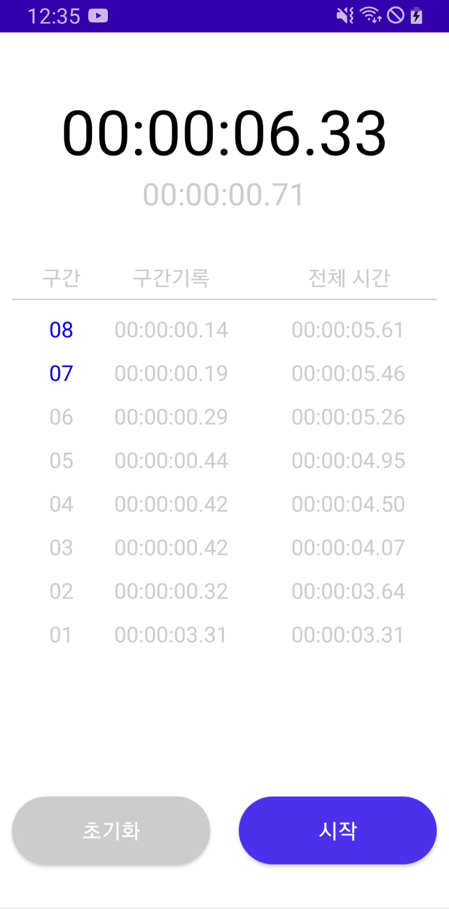

# ⏰ 삼성 갤럭시 시계 스톱워치 클론 코딩

## 🤔 프로젝트 설명

> Thread를 활용하여 삼성 갤럭시 기본 내장앱 '시계'의 스톱워치를 구현하였습니다.

 

### 💻 기술스택 

 

### 🛠 구현 사항
##### 1️⃣ 일반 타이머 / 인터벌 타이머
###### timer 함수를 통해 인터벌 타이머와 일반 타이머를 구현 하였습니다.

##### 2️⃣ 구간 기록 기능
###### RecyclerView를 활용하여 버튼 클릭 시 rep time이 기록되도록 구현 하였습니다.

##### 3️⃣ 동적 화면 구현
###### animation을 통하여 삼성 스톱워치의 동적인 화면을 구현 하였습니다. (ex : 최대 / 최소 rep time 동적으로 표시 , 첫 구간기록시 동적으로 리스트 표시)

 

### 🎥 시연 화면

